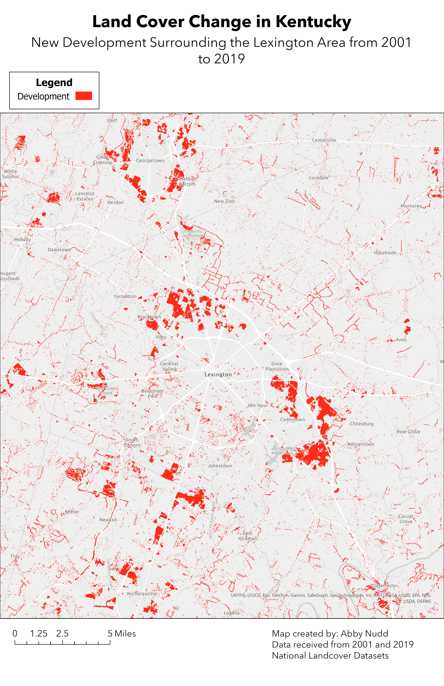

# land-development
Visualizing new development in Kentucky from 2001-2019
# Land Cover Change in Kentucky
## New Development Surrounding the Lexington Area from 2001 to 2019

There were mutliple areas in Kentucky that shifted from other land uses to development. In the Hamburg area there has been development of residential areas. There is new development surrounding Georgetown and Nicholasville. It also is clear that there has been development around the Blue Grass Airport.

  
*landcover*  

landcover - [Download geospatial PDF](landcover.pdf)

This map was created by Abby Nudd for GEO 409. The data was received from the 2001 and 2019 National Landcover Datasets.